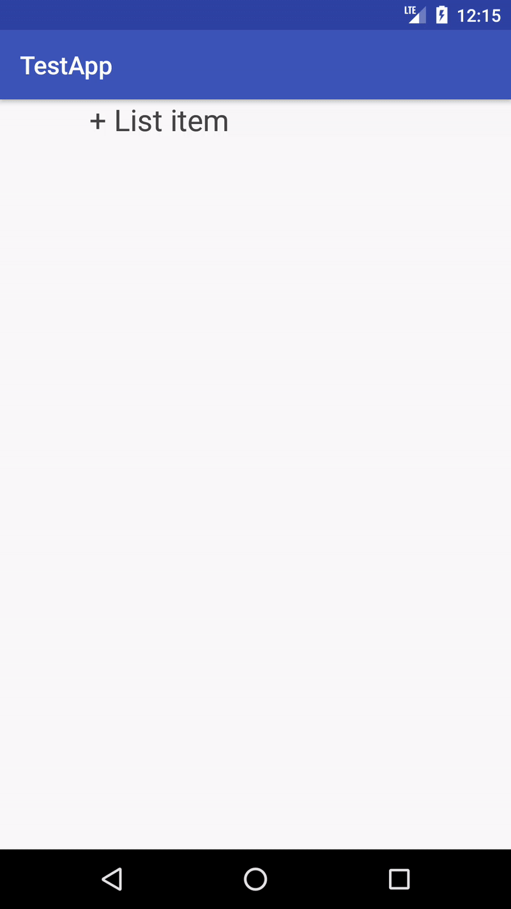
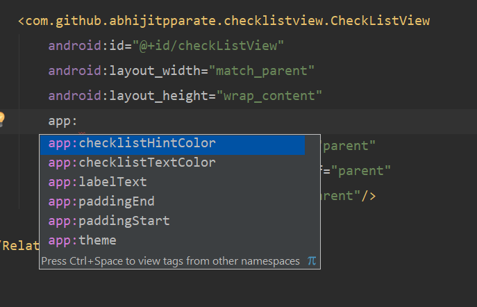

# ChecklistView
A simple checklist view featuring edit, delete, rearrange items.
Also converts to ArrayList of items and JSON.



## Gradle
```
dependencies {
    ...
    compile 'com.github.abhijitpparate.checklistview:checklistview:1.1.0'
}
```

## Usage

```
<com.github.abhijitpparate.checklistview.CheckListView
        android:id="@+id/checkListView"
        android:layout_width="match_parent"
        android:layout_height="wrap_content"
        app:layout_constraintLeft_toLeftOf="parent"
        app:layout_constraintRight_toRightOf="parent"
        app:layout_constraintTop_toTopOf="parent"/>
```

## Customization


